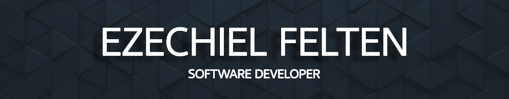
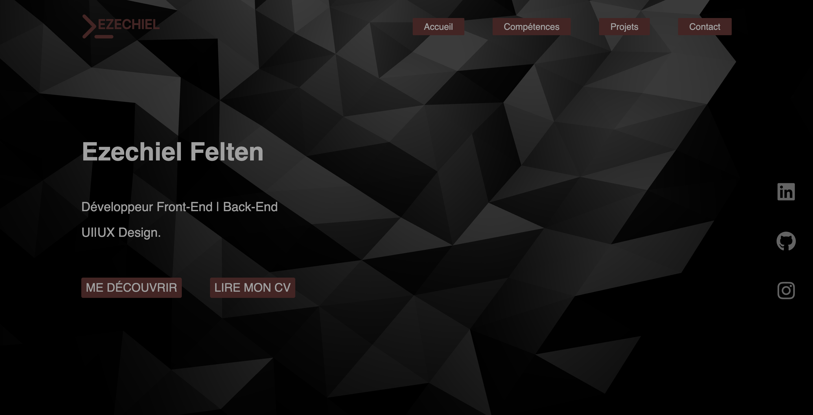

  

<h4 align="center">Développeur web et mobile certifié </h4>
<h4 align="center">J'ai accumulé une année d'expérience dédiée à la création d'applications web   ainsi qu'à la conception et au développement d'applications mobiles. </h4>

<!-- TECHS -->

<h2 align="center">Technologie utilisée</h2>

 
Frontend
: HTML
- CSS
- Javascript
- React js
- Twig
- bootstrap
 
Backend : PHP - Symfony - NODE JS - SQL - Mongo DB

 

<!-- PROJECTS -->

<h2 align="center">Mes expériences de projet.</h2>

	<table>
		<tr>
			<td width="50%">
				<h3 align="center">L'abattoire végétal</h3>
				
  
					
					 
					 
					

						  
		
					

					
<strong>Symfony - MongoDB - Javascript - Twig</strong>

          

						abattoire végétal est une applications web de restaurant végane. Invitez d'autres personnes à table avec vous pour réserver une date.
					

				

			</td>
			<td width="50%">
				<h3 align="center">Time clock</h3>
				
  
					
					 
					 
					

						  
					

					 
<strong> React Native - Expo js - Redux - Css </strong>

					
Time clock est une application mobile conçu pour créer des alarmes en leur ajoutant du texte, une fois l'alarme activé le texte sera prononcé jusqu`à ce que l'alarme soit désactivé

				

        </tr>
	    <tr>
            <td width="50%">
                <h3 align="center">Morning news</h3>
                
  
                    
                     
                     
                    

                          
						
                    

                    
<strong> HTML - CSS - React js - Node js - Redux </strong>

		    
Morning news est une aplications web qui vous maintient au courant des annonces et des actualités les plus récentes. Créez vous un compte et enregistrez vos articles favoris.

                

            </td>
            <td width="50%">
                <h3 align="center">Locapic</h3>
                
  
                    
                     
                     
                    

                        
                    

                    
<strong>React Native - Expo js - Redux - Css </strong>

		    
Locapic est une application mobile qui vous permet de marquer vos destinations favorites sur la carte, ainsi que vos destinations futures. 

                
	
            </td>
        </tr>
			<td width="50%">
                <h3 align="center">Portfolio</h3>
                
  
                    
                     
                     
                    

						  
		
                    

                    
<strong>Next JS - React JS - GSAP - Vanta JS - Redux </strong>

		    
Explorez mon portfolio pour découvrir une exposition détaillée de mon parcours, de mes compétences ainsi que des descriptions complètes de chacun de mes projets

                
	
            </td>
	</table>

 
 

<!-- SOCIALS -->

<h2 align="center">Contactez-moi</h2>
<h6 align="center">feltenezechiel1@gmail.com | 07 49 96 40 39</h6>

	&nbsp&nbsp&nbsp
&nbsp&nbsp&nbsp

